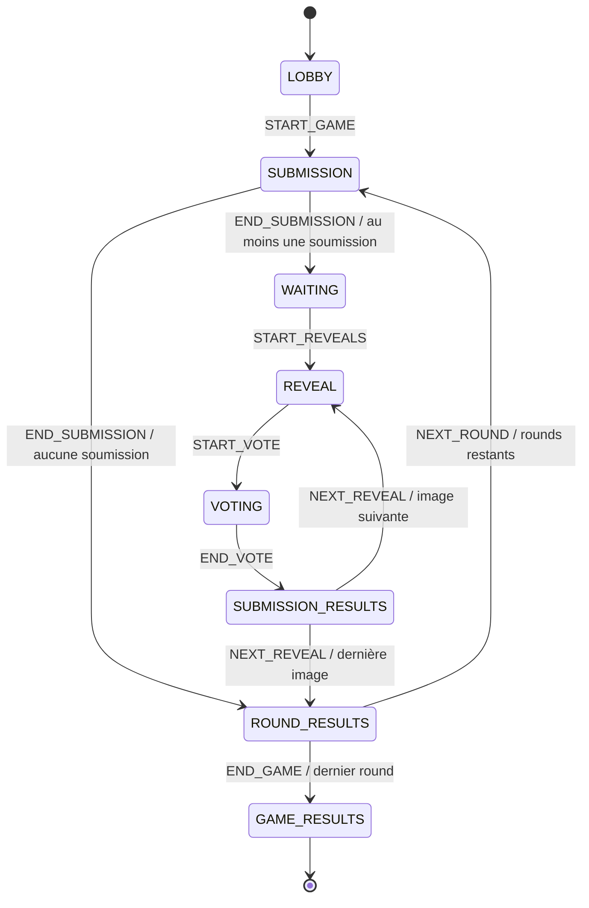

# Machine à états — étape 4

Le moteur est dans `server/src/game/gameMachine.ts`. Les types publics `GameState`
et `GamePhase` sont dans `shared/src/game.ts`. Aucun endpoint ni événement Socket.IO
ne permet au client de choisir une phase ou d'envoyer directement un événement moteur.

## Graphe

`WAITING` est l'attente globale du Host après clôture des soumissions. L'attente
individuelle d'un joueur ayant déjà soumis ne changera pas la phase globale.
`SUBMISSION_RESULTS` distingue la présentation de l'auteur et du score de la
période de vote ; aucun score n'est encore calculé à cette étape.

## Responsabilités et raccordement

`transitionGame(machine, event)` retourne une nouvelle machine sans modifier son
entrée. Le moteur ne crée pas d'UUID, ne lit pas l'heure, ne lance pas de timer,
ne charge pas d'image et ne calcule pas de vote. Les entrées sont déterministes.

`RoomService.startGame` vérifie l'appartenance du joueur, le rôle Host, la version
des paramètres, au moins deux membres et tous prêts. Il génère les identifiants
et l'heure, puis applique `START_GAME`. Le handler existant diffuse le nouveau
snapshot à tous les membres via `room:update`.

`RoomService.advanceGame(roomId, event)` est le point d'entrée interne des futurs
services et timers. Il calcule d'abord la transition, puis remplace la machine et
incrémente la révision du salon uniquement en cas de succès. Il retourne le
snapshot public que l'orchestrateur devra diffuser. Il n'est pas enregistré comme
commande Socket.IO. Les autres transitions sont actuellement exercées par les
tests uniquement, en attendant le raccordement des fonctionnalités suivantes.

| Événement interne | Responsabilité du futur appelant |
| --- | --- |
| `END_SUBMISSION` | Vérifier l'échéance ou toutes les soumissions, fournir les identifiants validés dans l'ordre de révélation choisi côté serveur |
| `START_REVEALS` | Vérifier que le demandeur est le Host et membre du salon |
| `START_VOTE` | Déclencher la fin du délai de révélation côté serveur |
| `END_VOTE` | Verrouiller les votes et calculer le résultat avant sa publication |
| `NEXT_REVEAL` | Déclencher la fin de présentation du résultat côté serveur |
| `NEXT_ROUND` | Créer l'identifiant du round suivant et ses données métier |
| `END_GAME` | Préparer le classement général après le dernier round |

Le moteur vérifie la légalité de la transition. La validation des propriétaires
d'images, des votes et des autorisations reste dans les services/handlers qui
appelleront ces événements : ce moteur ne remplace pas ces règles métier.

## Protections

- `state.version` augmente à chaque transition ; elle est distincte de
  `RoomSnapshot.revision`, qui augmente aussi pour les modifications du lobby
  et les départs de joueurs.
- Chaque événement porte `expectedVersion`. Un événement rejoué ou un ancien
  callback ne peut pas appliquer deux fois une transition.
- Les événements de round portent aussi `gameId` et `roundId`. Une commande
  d'un ancien round est refusée, même si elle prétend avoir la version actuelle.
- Les futurs timers devront capturer ces identifiants et cette version lors de
  leur création, sans les remplacer par l'état courant lors du callback.
- Une transition illégale lève `GameTransitionError` sans modifier le salon.
  Les codes distinguent état interdit, événement obsolète et données invalides.
- Un salon fermé est introuvable pour les callbacks ultérieurs. Le cycle de
  fermeture reste extérieur à la machine et ne produit pas un faux classement.
- Un round vide passe directement à `ROUND_RESULTS`. Un nouveau round ne peut
  pas dépasser le nombre configuré ; `END_GAME` exige le dernier round terminé.
- `GAME_RESULTS` est terminal : pas de retour au lobby ou de nouvelle partie
  implicite, fonctionnalités qui ne sont pas encore demandées.

## Données publiques et privées

Le `GameState` public est une union discriminée par `phase`. Le lobby ne contient
que la phase et sa version. Les états actifs contiennent le contexte de partie ;
les phases de round ajoutent son identifiant et son numéro. Seules `REVEAL`,
`VOTING` et `SUBMISSION_RESULTS` incluent l'identifiant de la soumission courante.

`revealOrder` et `revealIndex` restent dans le modèle serveur `GameMachine`.
`projectGameState` construit le contrat public champ par champ : une phase d'attente
ne révèle aucune soumission future et une révélation n'expose que la soumission
courante. Aucun auteur, fichier, URL ou vote n'est encore modélisé.

## Limites observables de cette étape

Après lancement, les deux clients affichent le round 1 en phase `SUBMISSION`.
La partie y reste : ni compte à rebours ni bouton artificiel « phase suivante »
ne sont ajoutés. Les autres phases et les boucles sont validées dans les tests
du moteur avec des identifiants fictifs. L'étape 5 raccordera le timer de
soumission ; les uploads, révélations visuelles et votes viendront ensuite.
